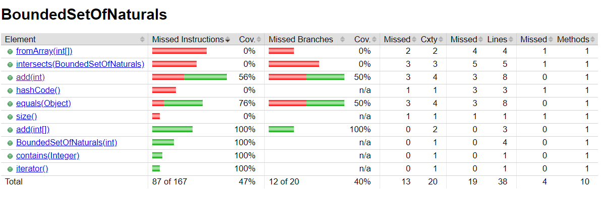
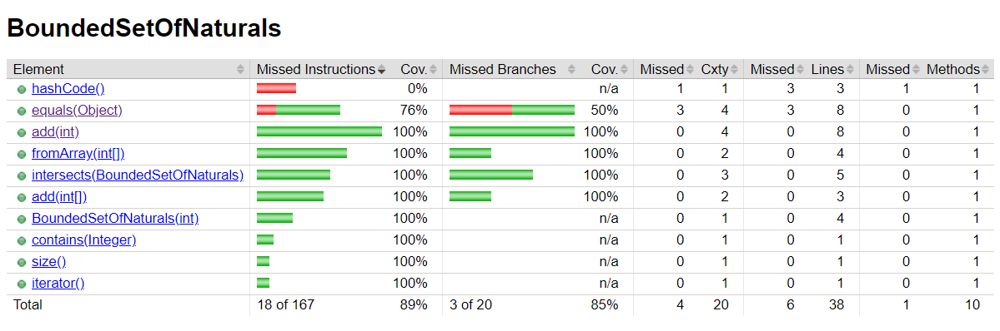

# Ex2 

## Bounded Set of Naturals

The tests for this class do not test every possible case of when a element is added to the set and do not test at all the function 'fromArray' and 'intersects'. The initial jacoco report is as follows:

The tests for the 'add' method we're revised to comply with the initial implementation of the class and test the following cases:

- Add a element to a full set
- Add a repeated element to a set
- Add a negative element to a set

The method 'intersects' was developed to check if two sets have any element in common, along with a respective test.

After this improvements, the jacoco report is as follows:

´
The function hashcode() still has 0% coverage but it doesnt make sense to test it since its a Java default function.

