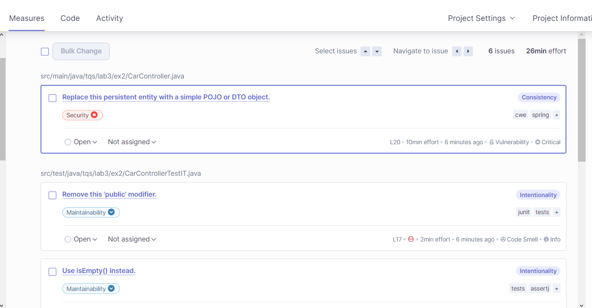
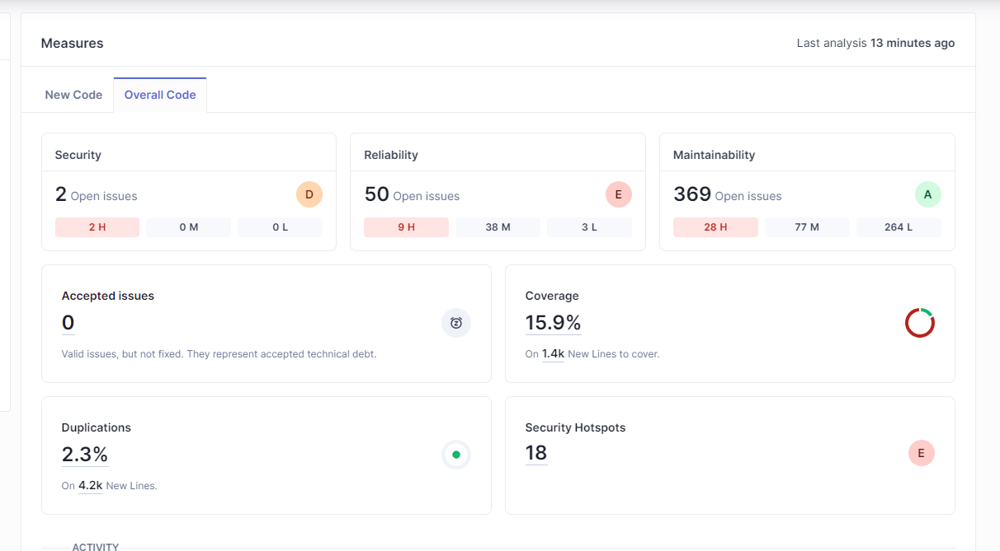
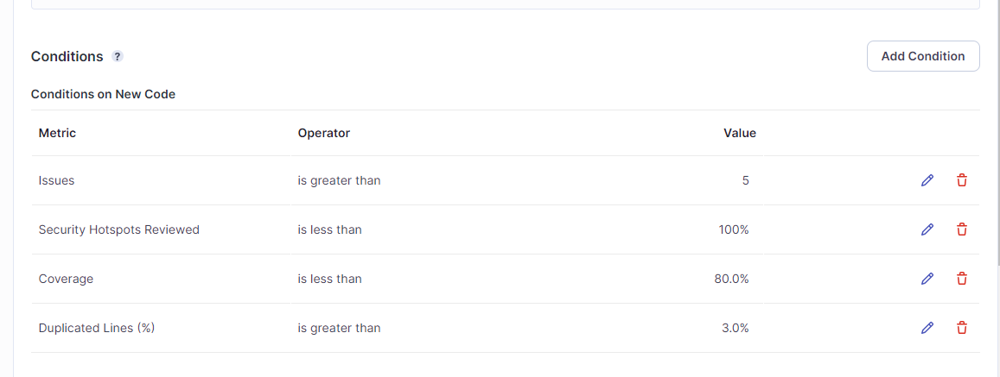
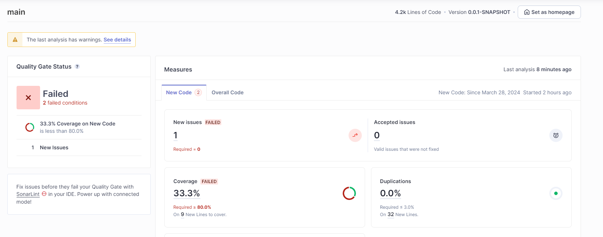

# Ex1 

The project has passed the defined quality gate, with the following metrics:

- **Accepted Issues**: 0
- **Coverage**: 74.5%
- **Duplication**: 0%
- **Security Hotspots** : 1

| Issue | Problem Description | How to Solve
| :--: | :---: | :---: |
| Code Smell ( major ) | Invoke method(s) only conditionally |  Structure your code to pass static or pre-computed values into Preconditions conditions check and logging calls.
| Code Smell ( minor ) | Unnecessary imports should be removed | Remove the import thats being unsued
| Code Smell ( major ) | Refactor the code in order to not assign to this loop counter from within the loop body. | Include the i++ in the for expression instead of inside the body loop
| Code Smell ( minor ) | Reorder the modifiers to comply with the Java Language Specification | Write 'public static' instead of 'static public'
| Code Smell ( minor ) | The return type of this method should be an interface such as "List" rather than the implementation "ArrayList". | Return a List<> instead of ArrayList<>
| Code Smell ( minor ) | Replace the type specification in this constructor call with the diamond operator ("<>"). | create a ArrayList<> instead of ArrayList<Dip>
| Code Smell ( info)   | Remove this 'public' modifier. | JUnit5 test classes and methods should have default package visibility

# Ex2 

The technical debt is 26 min.
This means that the issues in the project should take around 26 minutes to be fixed.

## Coverage Analysis 

Overall, the code coverage is 100%
There are 0 lines of code that are not covered by any test.
There are 0 conditions that are not covered by any test.
The values are perfect =) .

# Ex3 

The initial Sonarqube analysis gave the following results:

In general, the code had a lot of issues, most of them several occurrences of the same problem.

I defined the following quality gate:

After making some changes to the code the result was the following:

The code now breaks the default quality gate ( even though i created a new one i couldnt find out how to change sonarqube to evaluate based on that one ).
It has a new issue and low coverage so it is not passing the quality gate.

